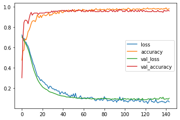

# Cancer_classification-using-NN
A basic model which classifies the cancer classes

The dataset is taken from Kaggle
Libraries required : Tensorflow, seaborn, sklearn ,pandas, numpy ,matplotlib

This is just to help learn some basic concepts of TF 2.0

This is how the graph looks after training and applying the early stopping.

